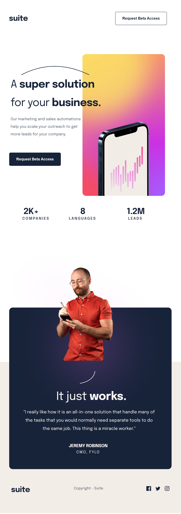
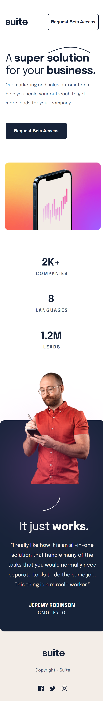

# Suite Landing Page | README Guide

# Project Discription

The suite landing page is a web application that helps users to scale their outreach to get more leads for their company. It enables users to:

1. View the optimal layout depending on their device's screen size
2. See hover states for interactive elements

## Live Project Link 

https://suite-umber.vercel.app/

## Tech Stack

HTML and CSS

## Features

1. Device responsivess.
2. Hover button effect.

# Preview

## Desktop 

## Tablet

## Mobile

## Lessons Learned 

Learned how to use media queries to make a page responsive.

##
[@ericmanu] (https://github.com/ericmanu)